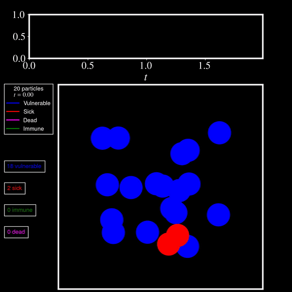

# VIRus Particle SIMulation with collisions (VirPSim)

    
    

## Package Description

The VIRus Particle SIMulation with collisions (VirPSim) istool to simulate particle dynamics with collision. Each particle can have four states: vulnerable, infected, immune and dead. The user selects the initial percentage of particles in each state. Additionally, it is possible to modify the probability of transmission during an interaction, the probability of becoming immune while infected, or the average time it takes for an infected particle to die.

VirPSim is designed to be semi user-friendly and flexible, allowing users to easily customize simulation parameter. 

## Usage

The `example.ipynb` file is a Jupyter Notebook that serves as an example or demonstration of how to use the VirPSim. 

## Requirements

To run VirPSim, you will need the following external package:

- `NumPy library`
- `Matplotlib library`
- `PyTorch`
- `tqdm`

If you want to make videos of the simulation, you have to install ffmpeg.
It is possible to use an NVDIA graphic card to perform the simulation. You have to install CUDA drivers.
